# OpenABX architecture

**Audience.** Engineers implementing OpenABX in Phase 1+. Readers who want the "why" behind specific choices should also consult `docs/adr/ADR-001`, `ADR-002`, `ADR-003`.

**Environment baseline (pinned 2026-04-22):**
- Alephium node **v4.5.1** (post-Danube fork, 2025-07-15)
- `@alephium/web3` + `@alephium/cli` + `@alephium/web3-react` + `@alephium/web3-test` + `@alephium/walletconnect-provider`, all **v3.0.3** (published 2026-04-20)
- Next.js 14 App Router, TS strict, Tailwind, shadcn/ui
- DIA xMarket oracle for ALPH/USD

---

## 1. Contract decomposition

We adopt the same file-level decomposition that the AlphBanX team settled on (confirmed by the Inference AG audit's scope section). Using identical role names makes ABI-compat work with mainnet AlphBanX much tractable; using identical *code* is forbidden (clean-room).

```
contracts/
  token/
    ABDToken.ral                 # Stablecoin. Mint authority = LoanManager.
    ABXToken.ral                 # Bank token. 100M fixed supply at deployment.
  oracle/
    DIAAlphPriceAdapter.ral      # Thin wrapper over DIA xMarket ALPH/USD.
    ABDPriceOracle.ral           # Constant $1 oracle for ABD (sentinel).
  settings/
    PlatformSettings.ral         # Admin + wiring: addresses of all other contracts + mutable fee table.
  loan/
    LoanManager.ral              # Parent for per-tier InterestPool subcontracts. Holds the global sorted loans structure.
    BorrowerOperations.ral       # User-facing router. All wallet → protocol calls land here first.
    InterestPool.ral             # Subcontract, one per interest tier {1,3,5,10,15,20,25,30} %. Holds Loan subcontracts + per-pool sorted list.
    Loan.ral                     # Subcontract per (owner, tier). State = {q, ir, t, c} + prev/next links.
    SortedList.ral               # Generic doubly-linked list primitive. Shared by loan/ and vesting/.
    ListNode.ral                 # Subcontract node.
  auction/
    AuctionManager.ral           # Parent for AuctionPool subcontracts. Holds aggregate ABD; routes liquidation cascade.
    AuctionPool.ral              # Subcontract, one per discount tier {5,10,15,20} %. Holds per-depositor shares (P/S snapshot).
    Bid.ral                      # Subcontract per-depositor record in a pool.
    Bidder.ral                   # Per-wallet index across all pools.
    AuctionFarming.ral           # Separate contract managing the 7M ABX yield-farm allocation (12-month linear vesting for Earn depositors).
  staking/
    StakeManager.ral             # ABX staking. Emits ALPH rewards to stakers via fee-split index.
    Staker.ral                   # Subcontract per-wallet stake position.
    LockInfo.ral                 # Subcontract holding a pending unstake with 14-day cooldown.
  vesting/
    Vesting.ral                  # Earn-pool ABX yield-farming vesting (12-month linear).
    Schedule.ral                 # Subcontract per beneficiary.
```

Total: **9 top-level contracts + 8 subcontracts**. Match to the audit's scope section is exact except we explicitly name the oracle wrapper and the constant-ABD-price sentinel separately.

### 1.1 Differences from original plan

| Plan said | Reality (from audit + live) | We build |
|---|---|---|
| `VaultManager` | `LoanManager` | `LoanManager` (AlphBanX's name; required for ABI-compat aspirations) |
| Single `AuctionPool` with 4 tiers | `AuctionManager` parent + 4× `AuctionPool` children | Parent + 4 children (ADR-001) |
| `StabilityAccounting` | Folded into `AuctionPool`'s P/S snapshot fields | Inline |
| `SortedVaults` | `SortedList` + `ListNode`, reused by Vesting | Reused primitive |
| No `PlatformSettings` | AlphBanX has a `PlatformSettings` admin/wiring contract | We build it. Holds the fee table + references to all other contracts so frontend can read a single on-chain source for addresses. |
| No `BorrowerOperations` | AlphBanX has it | We build it (BorrowerOperations.ral) |

---

## 2. Component diagram

```mermaid
flowchart TB
  subgraph Users
    U[Wallet EOA]
  end

  subgraph Settings
    PS[PlatformSettings]
  end

  subgraph Oracle
    DIA[DIAAlphPriceAdapter]
    ABDP[ABDPriceOracle]
    DIAX[(DIA xMarket\nexternal)]
  end

  subgraph Tokens
    ABD[ABDToken]
    ABX[ABXToken]
  end

  subgraph Loans
    BO[BorrowerOperations]
    LM[LoanManager]
    IP1[InterestPool_1%]
    IP3[InterestPool_3%]
    IPN[... 6 more tiers]
    L1[Loan_userA]
    SL[SortedList + ListNode]
  end

  subgraph Auction
    AM[AuctionManager]
    AP5[AuctionPool_5%]
    AP10[AuctionPool_10%]
    AP15[AuctionPool_15%]
    AP20[AuctionPool_20%]
    AF[AuctionFarming]
  end

  subgraph Staking
    SM[StakeManager]
    ST[Staker + LockInfo]
  end

  subgraph Vesting
    V[Vesting]
    SCH[Schedule]
  end

  U -->|"open / adjust / repay"| BO
  U -->|"deposit / withdraw"| AM
  U -->|"stake / unstake / claim"| SM
  U -->|"claim vested ABX"| V

  BO --> LM
  BO --> AM
  LM --> IP1 & IP3 & IPN
  IP1 --> L1
  L1 --- SL

  LM -->|"mint/burn"| ABD
  BO -->|"price"| DIA
  AM -->|"price"| DIA
  LM -->|"price"| DIA
  DIA --> DIAX

  AM --> AP5 & AP10 & AP15 & AP20
  AP5 --> AF
  AF --> V
  AF -->|"ABX emission"| ABX

  SM --> ST
  SM -->|"ALPH rewards"| U

  PS -.-> LM & AM & SM & V & DIA & ABDP
  classDef admin fill:#332,stroke:#aa0
  class PS admin
```



---

## 3. Asset Permission System (APS) cookbook

Post-Danube Ralph forbids silent token pulls. Every cross-contract asset movement is authorized at the **call site** with brace syntax. Idiomatic patterns we will use:

### 3.1 Open loan (borrower → LoanManager)

```ralph
// In BorrowerOperations.ral
@using(preapprovedAssets = true, assetsInContract = false)
pub fn openLoan(borrowAmt: U256, interestTier: U256) -> () {
  let caller = callerAddress!()
  let collateralAmt = tokenRemaining!(caller, ALPH)   // amount caller attached
  assert!(collateralAmt > 0, ErrNoCollateral)

  loanManager.openLoan{caller -> ALPH: collateralAmt}(
    caller, collateralAmt, borrowAmt, interestTier)
}
```

Caller-side: `borrowerOperations.openLoan{walletAddr -> ALPH: 100 alph}(1000 abd, 5 /*tier*/)`. The `{walletAddr -> ALPH: 100 alph}` is the key APS phrase — the brace scope authorizes exactly that amount for this call and any nested calls.

### 3.2 Deposit to auction pool (borrower holds ABD, sends to AuctionManager)

```ralph
// In AuctionManager.ral
@using(preapprovedAssets = true, assetsInContract = true)
pub fn deposit(poolIndex: U256, amount: U256) -> () {
  let caller = callerAddress!()
  transferTokenToSelf!(caller, abdTokenId, amount)    // pull ABD in
  let pool = AuctionPool(subContractId!(toByteVec!(poolIndex)))
  pool.creditDeposit(caller, amount)
}
```

### 3.3 Mint ABD to borrower (LoanManager has asset authority)

```ralph
// In LoanManager.ral
@using(assetsInContract = true)
fn mintAbdTo(borrower: Address, amount: U256) -> () {
  ABDToken(abdContractId).mint{selfAddress!() -> ALPH: 0}(borrower, amount)
}
```

Note: `selfAddress!() -> ALPH: 0` is the convention for "this contract authorizes ALPH for call-site gas bubbling without actually spending ALPH assets."

---

## 4. Sorted-list design (ADR-002 short form)

Every loan is a subcontract under its `InterestPool` parent. Each loan stores `prevId`/`nextId`. For redemption:

- Off-chain indexer keeps the global cross-pool ascending-`ir` view.
- Redeemer supplies a **hint**: `(startPoolIndex, startLoanId, expectedPrev, expectedNext)`.
- On-chain `LoanManager.redeem` verifies hint: starts at the proposed loan, walks forward consuming `q`, reverts if the hint was wrong (caller retries with a fresher one).
- Gas cost: `O(loans_consumed)` with no discovery overhead. This is exactly how Liquity v1 works on Ethereum; the pattern ports cleanly to Alephium's sUTXO.

For insertions (`OpenLoan`, `BorrowMore`, `Repay` that reduces `q`): caller supplies `(prevId, nextId)` hint. Contract asserts `prev.q ≤ newLoan.q ≤ next.q` (or equivalent secondary key). Indexer can always compute this cheaply off-chain.

For close + remove: caller supplies no hint — contract re-links `prev.next = loan.next; next.prev = loan.prev` in O(1).

Full reasoning in `docs/adr/ADR-002-sorted-loans.md`.

---

## 5. Two-network SDK design

```
sdk/
  src/
    addresses.ts          # Switchable per network. Testnet = ours. Mainnet = observed AlphBanX.
    abi/
      openabx.ts          # Our Ralph-compiled ABI (testnet)
      alphbanx-mainnet.ts # Method indices observed in traffic — treated as ground truth for mainnet
    clients/
      LoanManager.ts      # Accepts both ABIs via discriminated union
      AuctionManager.ts
      ...
    index.ts              # `getClient(network, role)` factory
```

Phase 0.5 decision (§6): ABI compatibility with AlphBanX's mainnet contracts is **not achievable without reading their Ralph source** (prohibited). Therefore the SDK ships with two ABIs. Testnet calls use our ABI; mainnet calls use the observed ABI.

Frontend code always goes through the factory — it never imports a raw ABI. A single environment variable `NEXT_PUBLIC_NETWORK ∈ {devnet, testnet, mainnet}` drives selection.

---

## 6. Governance & admin

**Testnet only (we deploy):** a single timelock contract with a multisig owner. All parameter changes (fees, CR threshold, oracle address, unstake cooldown) gated by 24-hour timelock. Pause role on `CircuitBreaker` can halt OpenLoan / BorrowMore / Redeem / Liquidate without a timelock (emergency-only).

**Mainnet (we never deploy):** document that AlphBanX's admin role exists (mainnet EOA `1Fcq1KfXTVj3…`) and is out of our control. Our frontend must show a banner noting this on mainnet.

---

## 7. Circuit breaker

Separate `CircuitBreaker.ral` contract:

- One flag: `paused: Bool`.
- Pauser role (initially multisig; governance-transferable).
- Auto-pause trigger: oracle staleness > 30 minutes (measured as `block_timestamp − dia_last_update`). Computed inside every call to `BorrowerOperations.openLoan / borrowMore / redeem` and `LoanManager.liquidate`. Reverts if stale.
- Manual pause: only the pauser can flip the flag.
- No admin can seize user funds even while paused — loans remain closable, pool deposits remain withdrawable.

---

## 8. Indexer

Separate `indexer/` package (Node.js + SQLite):

- Subscribes to Alephium node events via `/events/contract/{addr}/…` polling.
- Maintains the cross-pool sorted loans view and per-pool depositor ledger.
- Exposes a small HTTP/WS API for the frontend: `/hints/redeem?amount=…` → `(startPoolIndex, startLoanId, prevId, nextId)`, `/hints/insert?q=…&tier=…` → `(prevId, nextId)`.
- Ships with a Dockerfile; `pnpm -C indexer dev` runs against local devnet.

---

## 9. Fuzz harness

Separate `tests/fuzz/` in the `contracts/` package:

- Stateful property-based testing using `fast-check` + `@alephium/web3-test`.
- Models: N borrowers (up to 50), 4 pools, random prices ∈ `[$0.01, $1]`, random actions per block.
- Invariants per §5 of the spec; each violation is a reproducible failing seed.
- Nightly CI runs 30 simulated days; PR CI runs 1 simulated day for speed.

---

## 10. Referenced ADRs

- `docs/adr/ADR-001-auction-design.md` — why four discrete pools (rejecting the paper's bid book).
- `docs/adr/ADR-002-sorted-loans.md` — why hint-verified doubly-linked subcontracts (rejecting on-chain discovery).
- `docs/adr/ADR-003-loan-subcontracts.md` — why one-subcontract-per-loan with `owner`-keyed path.

Additional ADRs to be authored in Phase 1+: ABI bridge (ADR-004), circuit breaker policy (ADR-005), indexer persistence (ADR-006), fuzz model details (ADR-007).
